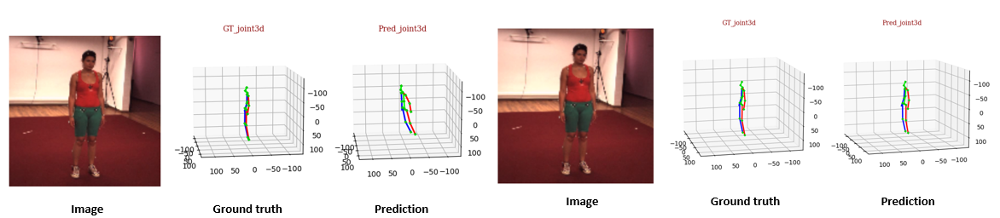

# DLAV_3DHumanPose


This work is mainly done based on the HEMlets [github repo](https://github.com/redrock303/HEMlets). The folder HEMlets contains their code of the repo.


Following are the two papers linked to the HEMlets code: <br>
[HEMlets Pose: Learning Part-Centric Heatmap Triplets for Accurate 3D Human Pose Estimation](https://arxiv.org/pdf/1910.12032.pdf)

[HEMlets PoSh: Learning Part-Centric Heatmap Triplets for 3D Human Pose and Shape Estimation](https://arxiv.org/pdf/2003.04894.pdf)


## What our code does
There are several parts of our code. In the DLAV folder is the code to train the network. We wrote the training based on what is written in the paper and what is done in the inference script from their repo.

The RealTime folder is the code that allows the user to run the testing in real time using the webcam of the computer. The user will be able to see the 3D pose estimated by the newtork of the realtime image from the webcam. For this to work properly the user must be totally in the image (from the head to the feet) and the head should match the top of the image and the feet the bottom.

The Inference_in_video folder contains the code that shows the 3D pose of the videos provided for the course and saves the json.

## Downloads
To run our code several parts need to be downloaded: 
- The [pre-trained weights](https://drive.google.com/drive/folders/1z8Jj0xx4SvHC-YKuw_M_c_Z4vA4HpzID?usp=sharing): donwnload 'ckpt' (hemlets_h36m_lastest.pth) and 'data' (S_11_C_4_1.h5)

- Download the [yolo weights](https://drive.google.com/drive/folders/17MXfRZ8hNNnaN2jv1XZGHxnoMsKEVLgN?usp=sharing) (classes.txt, yolov3.weights and yolov3.cfg)

- Download the Human3.6M dataset (SCITAS - h3.6)

To test on the videos from the class (test4_cut.mp4 for example), download the videos from [Google Drive](https://drive.google.com/drive/folders/16xf0AF9zgWAuK6Xyr5xK85t77hM3BwAv?usp=sharing)

Please, again we remind you to check the HEMlets [github repo](https://github.com/redrock303/HEMlets) and "Darknet: Open Source Neural Networks in C" [https://pjreddie.com/darknet/](Darknet: Open Source Neural Networks in C) where the weights come from.

## Architecture
The following architechture must be followed:


- ckpt
	- classes.txt
	- yolov3.weights
	- yolov3.cfg
	- hemlets_h36m_lastest.pth

- data
	- S11
		- S_11_C_4_1.h5
	- test_set
		- test4_cut.mp4
	- data_2d_h36m.npz
	- data_3d_h36m.npz
	- Directions.55011271.mp4 (and other videos from the Human3.6M)

- DLAV
	- checkpoints
	- codes

- HEMlets
	- requirement.txt

- Inference_in_video


## Environement
Create a new Conda environement:
```conda create -n DLAV python=3.7.7```

Install the needed librairies 
```pip install -r requirement.txt```

To run the training code. go to the DALV folder and either run 
```bash train.sh```
or 
```python train.py --dataset_path '../data/dataset.h5' --epochs 30 --batch_size 4 --num_workers 1 --lr 0.0001 --save_interval 1 --checkpoint_dir 'checkpoints' --data_ratio 0.4 --validation_ratio 0.1 --test_ratio 0.0```


To run the RealTime go to the RealTime folder and run ```bash inference.sh```

To run the tests on the video from the class go to the Inference_on_video folder and run ```bash inference.sh```

Some parameters can be modified in the .sh

## Report

We were tasked to train a network to detect the 3D human pose. There are two options to do this: lifting a 2D skeleton into 3D, or using the entire image. We started by trying out the lifting and it seemed pretty simple. We therefore wanted to try the 3D human pose detection from the image directly. This task is more difficult than lifting, but there is less information loss, which makes it interesting. 

### Contribution
As we had big difficulties finding the training code online, we wrote a training script based on the paper and on the inference provided with their Github Repo. In the original paper the authors flip the image and puts it in the network twice. They can then take the mean of both predictions to determine the 3D pose of the human detected. In our script we do not need to do this image flipping, allowing us to go twice as fast, which is what is needed for a real time application. In consequence, when we run our inference, with their weights, the skeleton is slightly diagonal.



This would probably have been corrected if we would have had time to train our network and would have had our weights. 

### Experimental setup
In order to test our code we started by first training on a single image to see if we where able to overfit the results to the ground truth. This was done succesfully. Since we had a lot of trouble obtaining the human3.6m dataset, we lost a lot of time, wwhich is why we where not able to train on the full dataset. We therefore used the weights provded by the HEMlets authors to do the inference. 

In order to determine if our network is good we used the MPJPE metric (Mean Per Joint Position Error). 


### Dataset
We used the Human3.6M dataset for our work. It can be downloaded from SCITAS (in ```work/scitas-share/datasets/Vita/civil-459/h3.6```). 


## Results


