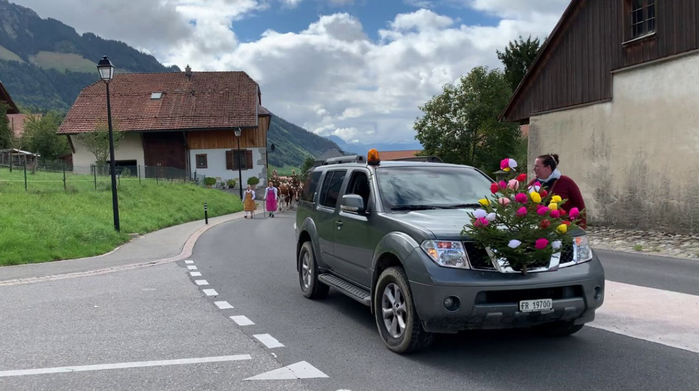

# DLAV_3DHumanPose


This work is mainly based on the HEMlets [github repo](https://github.com/redrock303/HEMlets). The folder HEMlets contains their code of the repo.


Following are the two papers linked to the HEMlets code: <br>
[HEMlets Pose: Learning Part-Centric Heatmap Triplets for Accurate 3D Human Pose Estimation](https://arxiv.org/pdf/1910.12032.pdf)

[HEMlets PoSh: Learning Part-Centric Heatmap Triplets for 3D Human Pose and Shape Estimation](https://arxiv.org/pdf/2003.04894.pdf)


## What our code does
There are several parts of our code. In the DLAV folder is the code to train the network. We wrote the training based on what is written in the paper and what is done in the inference script from their repo.

The RealTime folder is the code that allows the user to run the testing in real time using the webcam of the computer. The user will be able to see the 3D pose estimated by the network of the realtime image from the webcam. For this to work properly the user must be totally in the image (from the head to the feet) and the head should match the top of the image and the feet the bottom.

The Inference_in_video folder contains the code that shows the 3D pose of the videos provided for the course and saves the json.

## Downloads
To run our code several parts need to be downloaded: 
- The [pre-trained weights](https://drive.google.com/drive/folders/1z8Jj0xx4SvHC-YKuw_M_c_Z4vA4HpzID?usp=sharing): download 'ckpt' (hemlets_h36m_lastest.pth) and 'data' (S_11_C_4_1.h5)

- Download the [yolo weights](https://drive.google.com/drive/folders/17MXfRZ8hNNnaN2jv1XZGHxnoMsKEVLgN?usp=sharing) (classes.txt, yolov3.weights and yolov3.cfg)

- Download the Human3.6M dataset (SCITAS - h3.6)

To test on the videos from the class (test4_cut.mp4 for example), download the videos from [Google Drive](https://drive.google.com/drive/folders/16xf0AF9zgWAuK6Xyr5xK85t77hM3BwAv?usp=sharing)

Please, again we remind you to check the HEMlets [github repo](https://github.com/redrock303/HEMlets) and "Darknet: Open Source Neural Networks in C" [https://pjreddie.com/darknet/](Darknet: Open Source Neural Networks in C) where the weights come from.

## Architecture
The following architecture must be followed:


- ckpt
	- classes.txt
	- yolov3.weights
	- yolov3.cfg
	- hemlets_h36m_lastest.pth

- data
	- S11
		- S_11_C_4_1.h5
	- test_set
		- test4_cut.mp4
	- data_2d_h36m.npz
	- data_3d_h36m.npz
	- Directions.55011271.mp4 (and other videos from the Human3.6M)

- DLAV
	- checkpoints
	- codes

- HEMlets
	- requirement.txt

- Inference_in_video


## Environment
Create a new Conda environment:
```conda create -n DLAV python=3.7.7```

Install the needed libraries  
```pip install -r requirement.txt```

To run the training code. go to the DALV folder and either run 
```bash train.sh```
or 
```python train.py --dataset_path '../data/dataset.h5' --epochs 30 --batch_size 4 --num_workers 1 --lr 0.0001 --save_interval 1 --checkpoint_dir 'checkpoints' --data_ratio 0.4 --validation_ratio 0.1 --test_ratio 0.0```


To run the RealTime go to the RealTime folder and run ```bash inference.sh```

To run the tests on the video from the class go to the Inference_on_video folder and run ```bash inference.sh```

Some parameters can be modified in the .sh

## Report

We were tasked to train a network to detect the 3D human pose. There are two options to do this: lifting a 2D skeleton into 3D, or using the entire image. We started by trying out the lifting and it seemed pretty simple. We therefore wanted to try the 3D human pose detection from the image directly. This task is more difficult than lifting, but there is less information loss, which makes it interesting. 

### Contribution
As we had big difficulties finding the training code online, we wrote a training script based on the paper and on the inference provided with their Github Repo. In the original paper the authors flip the image and puts it in the network twice. They can then take the mean of both predictions to determine the 3D pose of the human detected. In our script we do not do this image flipping, allowing us to go twice as fast, which is what is needed for a real time application but this is at the cost of loosing accuracy. In consequence, when we run our inference, with their weights, the skeleton is slightly diagonal.


This would probably have been corrected if we would have had time to train our network and would have had our weights. 

We added a YOLO to our code. It allows to detect the people in the image and to crop around them. This is necessary for our network to work correctly. In addition, this allows to predict the 3D position of all the human on a picture by cropping around each of the person and feeding the network with the cropped image of each person.


### Experimental setup
In order to test our code, we started by first training on a single image to see if we were able to overfit the results to the ground truth. This was done successfully. Since we had a lot of trouble obtaining the human3.6m dataset and also to find what they could have put in the original script in order to train properly, we lost a lot of time, which is why we were not able to train on the full dataset. If we would have more time, we would have tried to train on all images and all actions from all the actors except two for example and use those last two as validation set.

We therefore used the weights provided by the HEMlets authors to do the inference. 

We first tried to overfit the ground truth of an image in order to make sure our network was capable of doing this. We did this by training our network on top of the weights provided with the paper and from scratch. Both results where satisfying. The following image shows the initialisation and the result of over fitting an image from scratch.


We then tried training a mini batch (10 images, 8 for training and 2 for validation) in order to test our network. The following plots show the loss and the MPJPE (Mean Per Joint Position Error) decreasing with the epochs.  


We tried training on scitas, but the training script was really slow and we didn't have enough time to train on the entire dataset. Still we did try to train on a small dataset (10'000 iamges) on scitas but we did not get the results yet...

We used the loss described in the paper (a mix of a the HEMlets loss which is based on the heat maps, the 2D loss and the 3D loss). We then used the MPJPE as validation metrics to attest the correctness of our results.

We see on the first image that the training and validation losses decrease which is a good thing. But by looking on the second picture, we observe that the MPJPE loss of the validation is really bad compared to the training one. This could be explained by the really small dataset we used for training. Since we only have two images in the validation set, if we have bad luck and the network predicts really badly the 3D pose on those images the validation metric will remain big and no other image can compensate for those big values.


### Dataset
We used the Human3.6M dataset for our work. It can be downloaded from SCITAS (in ```work/scitas-share/datasets/Vita/civil-459/h3.6```). 

As the files where not properly uploaded on SCITAS, we tried many things: using the mini-dataset provided with the HEMlets paper, using another huamn3.6m on SCITAS (that uses CSV files, that we had to try and convert into something usable), etc... We were finaly able to use the data_2d_h36m.npz and the data_3d_h36m.npz files together with the videos. 
The ```dataset.py``` file allows the user to choose if they wish to use the entire dataset or just a particular batch or scene.

For the format of the dataset, we only take 18 joints and the labels are given by the 3D position related to the associated image. We also use the 2D joints location to create the heatmaps.

### Results

Since we were not able to train the network properly on the entire dataset, we did the inference with the weights provided with the paper. The following images show an image (extracted from one of the videos provided for the class). Our YOLO extracts the people one by one, and the network detects the 3D pose of each one of them. 




Concerning the MPJPE that we obtain, this is of course much worse than the original work since we did not train on as many images like they did. But still the skeleton looks good :)

## Conclusion

In summary, our project focused on implementing the HEMlets network for 3D human pose estimation. Although we faced time constraints that prevented us from training the network, we wrote the entire code and tested on a few images. We included a YOLO in the script to detect humans, facilitate the 3D pose estimation and performing multiperson pose estimation. Choosing to do a 3D pose estimation based on the image directly and not through lifting allowed us to try something different, despite the added difficulty.


